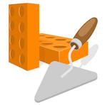

# bringon

 
 

**bringon**  - **B**uild **R**egistry (written **IN** **GO**la**N**g)

This is a RESTful webservice written in Golang.
The purpose of the service is to register software build results and metadata.

The far-fetched vision for this is to become the central information hub for distributed,
loosely coupled microservice systems.
Types of data we plan to support:
 * dependencies
 * API definitions
 * consumer-driven contracts
 * quality metrics and reports
 * real-time deployment info

 Integrations with systems like: Swagger, PACT broker, Taiga, Jira, Artifactory et al. are planned.
